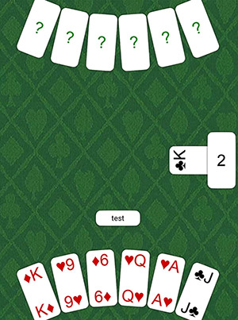

# Durak Online

Сетевая игра в карты "Дурак". Для GUI использован Kivy. Сделанно для канала [@WANNADEAUTH](t.me/wannadeauth)




## Запуск на Android

[Установка Buildozer](https://kivy.org/doc/stable/guide/packaging-android.html)

Если у вас Mac OS, то выполните из терминала команды (можно из Terminal из PyCharm):

```pip install Cython
git clone https://github.com/kivy/buildozer.git
cd buildozer
sudo python setup.py install
```

Подключи устройство и разреши отладку по USB

Установка и запуск приложения на Android устройстве:

```buildozer android debug deploy run```

Если что-то не работает, то следует изучить логи на устройстве. Для этого есть команда:

```adb logcat -T 1 python:D "*:S"```

Она фильтрует с устройства только те логи, которые относятся к Kivy.

## ToDo

1. Перевод карты
2. Выбор, что отбить данной картой
3. Не скрывать козырь, если взяли - сделать его полупрозрачным
4. Последнюю карту из колоды не убирать вправо, а дать ее в руку
5. Подбросить карты, если сопрерник берет

Данный репозиторий является не оффициальным форком на [durakmq](https://github.com/tirinox/durakmq). Автор не несет ответственности за точность, полноту или качество предоставленной информации. Никакие претензии за материальный или нематериальный ущерб, вызванный использованием или неиспользованием предоставленной информации либо использованием неверной или неполной информации, не принимаются, если этот ущерб не был явным следствием небрежности или преступного умысла автора. Все предложения выдвигаются без каких-либо обязательств. Автор оставляет за собой право изменять, удалять или дополнять содержимое веб-сайта без предварительного уведомления, а также удалять публикации в Интернете временно или навсегда.
